DRF API Store
=============

Overview
--------

DRF API Store is a Django REST Framework-based backend for a online store. It provides endpoints for managing users, products, shopping carts, and orders. The project is intended as a clean, modular foundation for e-commerce functionality.


Tech stack
----------

- Python 3.13 (or compatible)
- Django 6.x
- Django REST Framework
 - Celery for asynchronou, background tasks
 - Redis as Celery broker and cache

Project structure
-----------------

- `users` — user models and auth-related views
- `products` — product listing and detail endpoints
- `cart` — shopping cart models and endpoints
- `order` — order processing and management

Prerequisites
-------------

- Docker and Docker Compose (v2+) to run the full stack in containers

Quick Start with Docker
-----------------------

1. Ensure you have Docker and Docker Compose installed
2. Create a `.env` file with required environment variables (see `.env` in project)
3. Run the full stack:

   ```bash
   docker compose up --build -d
   ```

4. After containers start, access the application:
   - **DRF API Browser**: http://localhost:8000/
   - **Admin Panel**: http://localhost:8000/admin/ (default credentials: admin/admin)
   - **API Endpoints**: http://localhost:8000/api/v1/store/, /api/v1/orders/, etc.

5. Check services health:
   ```bash
   docker compose ps
   ```

Available Services
------------------

- **web**: Django + Gunicorn (main API) - Port 8000
- **celery**: Celery worker for background tasks
- **redis**: Redis cache and Celery broker - Port 6379
- **db**: PostgreSQL database - Port 5432
- Alternatively: Python 3.13, pip and a virtual environment to run locally

Environment
-----------

Create a `.env` file in the project root with at least the following variables:

- `SECRET_KEY` — Django secret key
- `POSTGRES_DB` — Postgres database name
- `POSTGRES_USER` — Postgres user
- `POSTGRES_PASSWORD` — Postgres password
- `POSTGRES_HOST` — usually `db` when using Docker Compose
- `POSTGRES_PORT` — usually `5432`

Docker usage
------------------------------------

1. Ensure you have a `.env` file configured (see "Environment" section).

2. Build and start all services:

```bash
docker compose up --build -d
```

The `web` container runs an entrypoint that applies migrations and collects static files automatically on startup, so manual migration is not required after bringing the stack up.

To run the Celery worker (if not started as a separate service), exec into the running container and start Celery:

```bash
docker compose exec web celery -A config worker --loglevel=info
```

4. (Optional) Create a superuser:

```bash
docker compose exec web python manage.py createsuperuser
```

5. The API will be available at `http://localhost:8000`.

Notes:
- The `web` service runs `gunicorn config.wsgi:application` on port `8000`.
- The `db` service uses Postgres 15 and persists data in a Docker volume `postgres_data`.

Docker + host (DB/Redis in Docker, app on host)

If you prefer running the Django app on your host machine while using Docker for database and redis:

```bash
# start DB and Redis
docker compose up -d db redis

# on host, in your virtualenv
pip install -r requirements.txt
python manage.py migrate
python manage.py runserver
```

Running locally without Docker
-----------------------------

1. Create and activate a virtual environment.
2. Install dependencies:

	pip install -r requirements.txt

3. Configure your `.env` or environment variables.
4. Apply migrations and run the server:

	python manage.py migrate
	python manage.py runserver

API overview
------------

The API exposes endpoints grouped by app. The project mounts routes under `/api/v1/` in `config/urls.py`. Replace `localhost` with your host if different.

- Product list (GET): http://localhost:8000/api/v1/store/
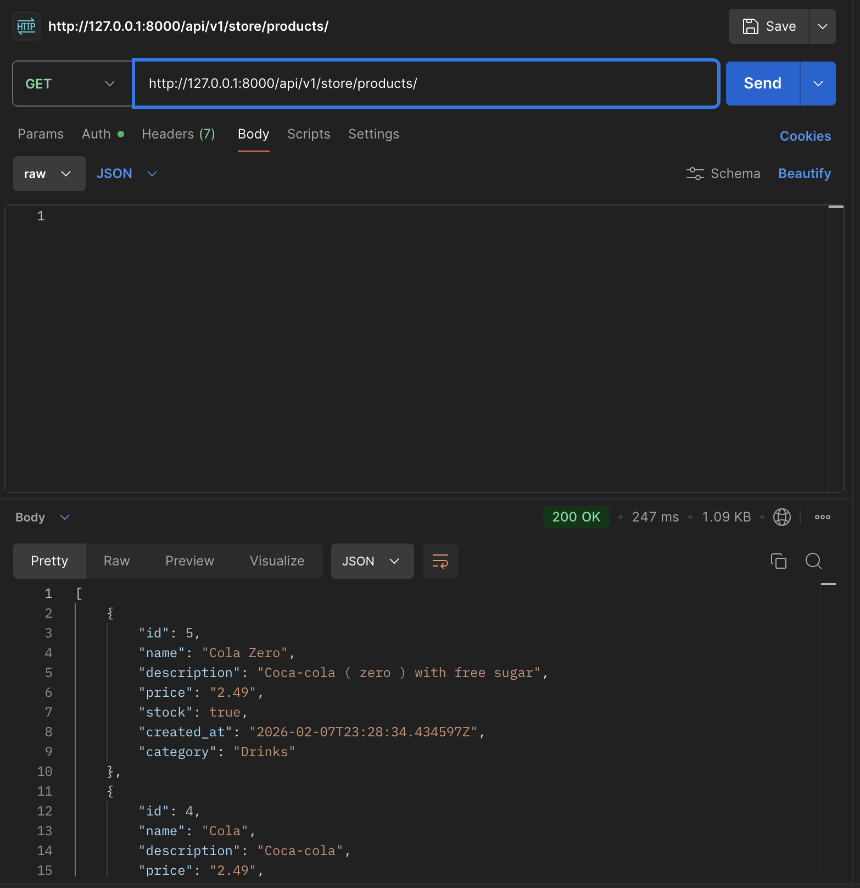
- Product detail (GET/PUT/PATCH/DELETE): http://localhost:8000/api/v1/store/1/
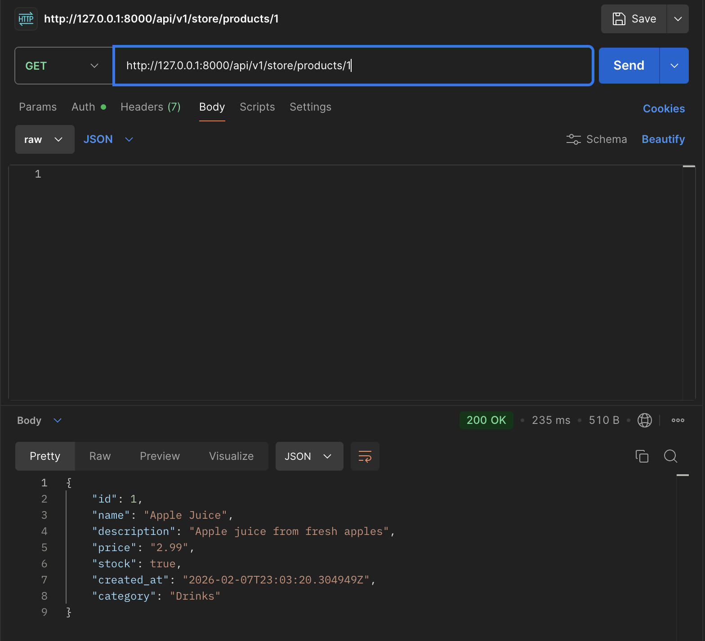
- Product categories (GET): http://localhost:8000/api/v1/store/categories/
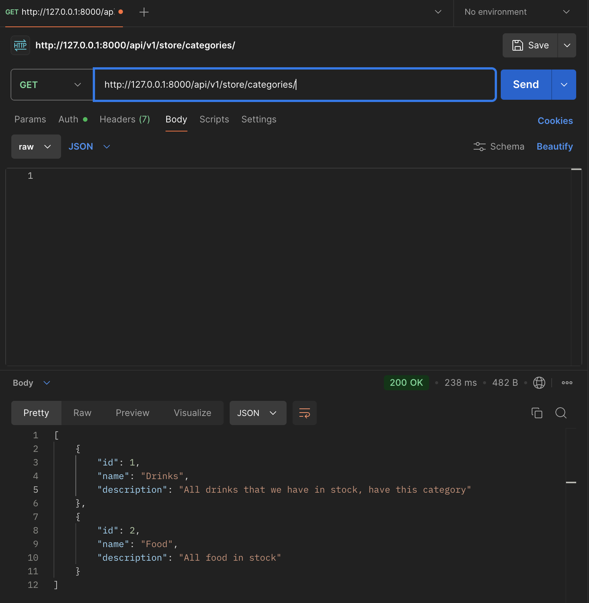
- Category detail (GET): http://localhost:8000/api/v1/store/categories/1/
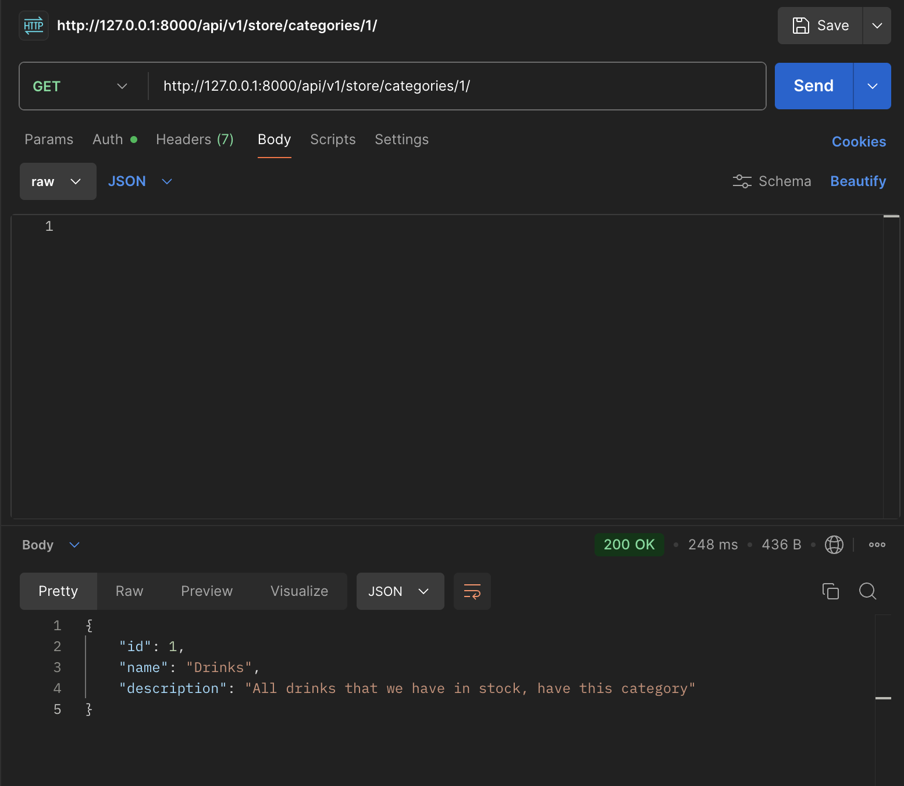

- Register (POST): http://localhost:8000/api/v1/users/register/
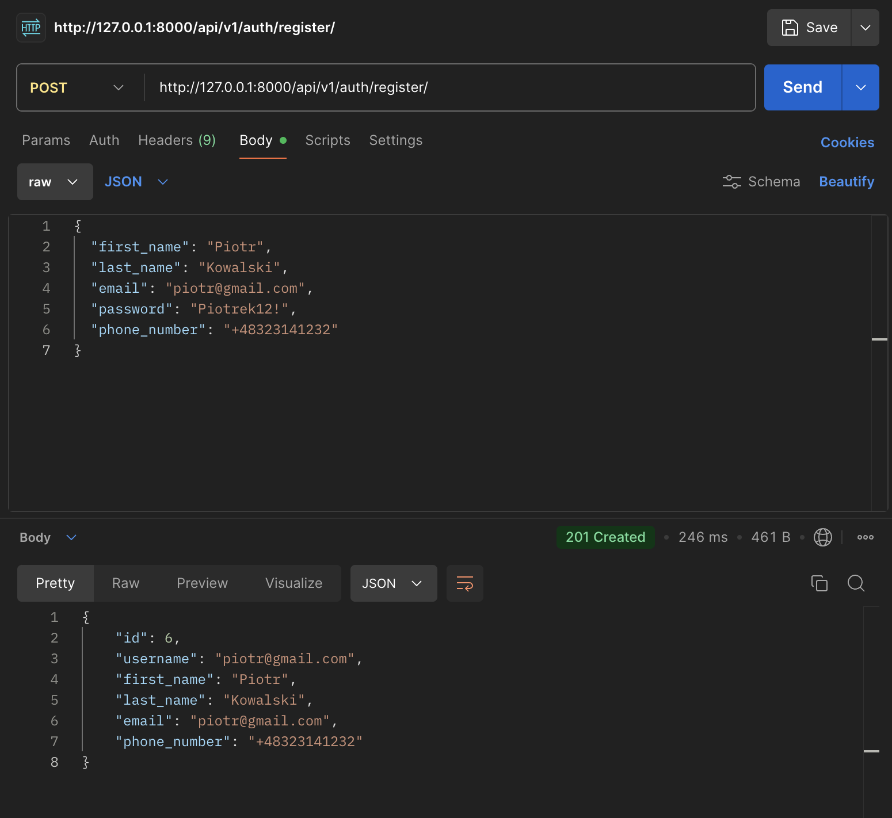

- View cart (GET): http://localhost:8000/api/v1/carts/  (returns current user's cart; auth required)
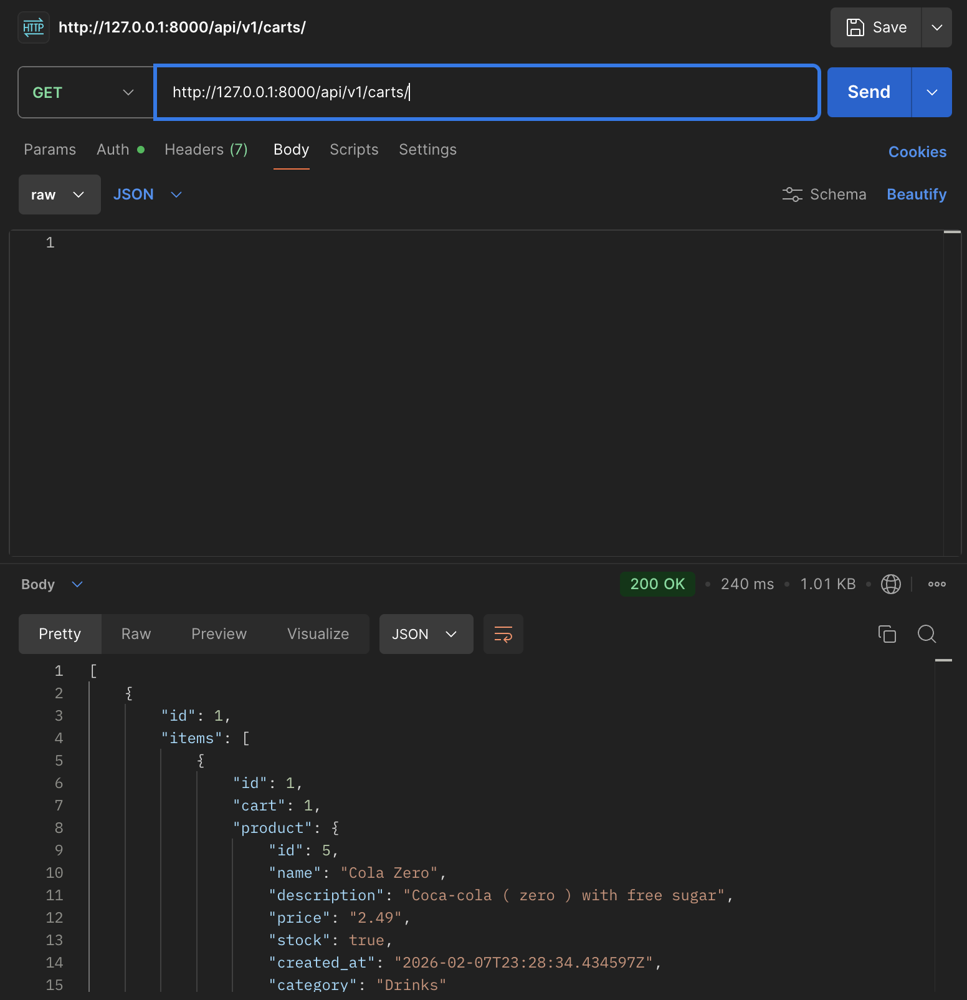
- Cart item detail (GET/PUT/PATCH/DELETE): http://localhost:8000/api/v1/carts/items/1/  (detail for a single cart item / product in the cart)
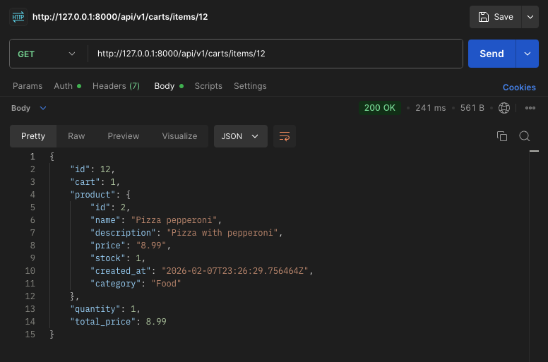
- Add item to cart (POST): http://localhost:8000/api/v1/carts/add_item/  (body: `product_id`, `quantity`; auth required)
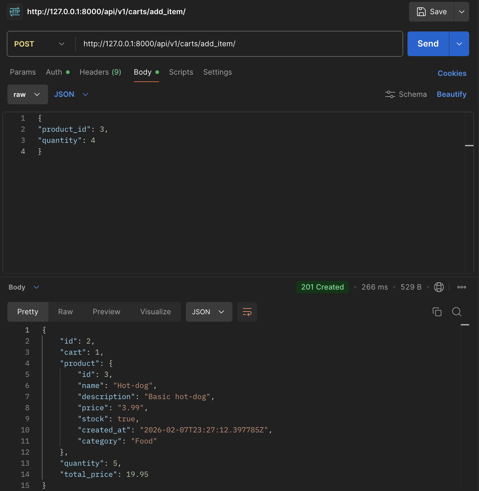


- List orders (GET): http://localhost:8000/api/v1/orders/order_list/
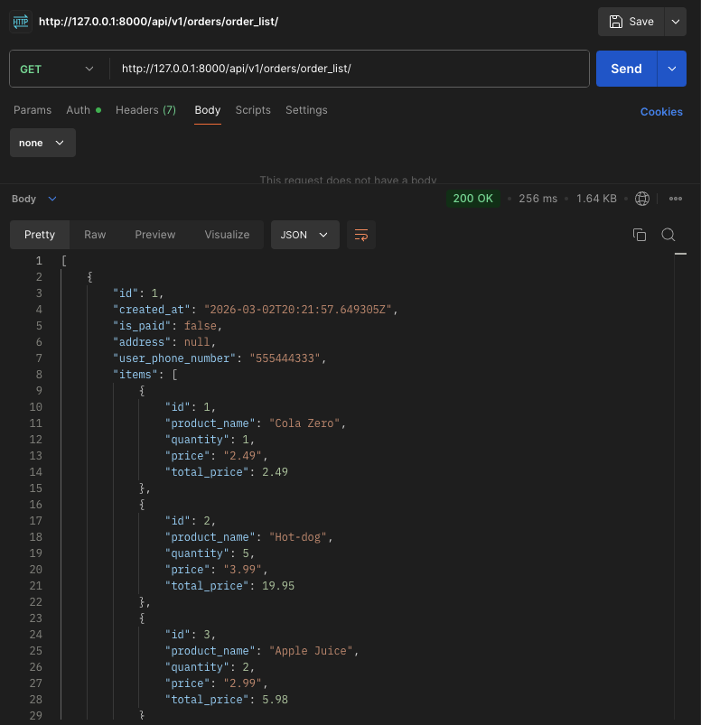
- Order detail (GET): http://localhost:8000/api/v1/orders/order_detail/1/
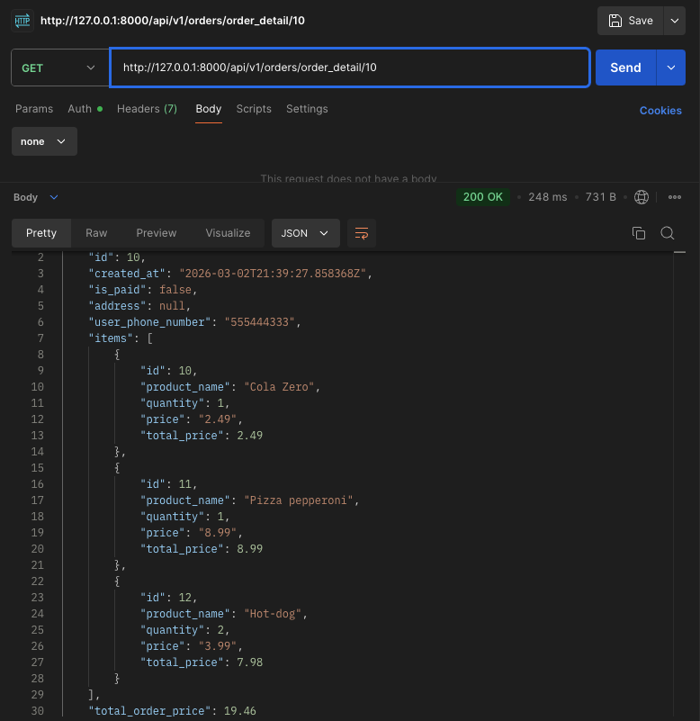
- Order create (POST): http://localhost:8000/api/v1/orders/order_create/
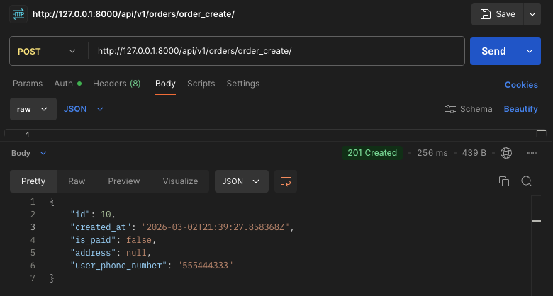

- Admin site (browser): http://localhost:8000/admin/
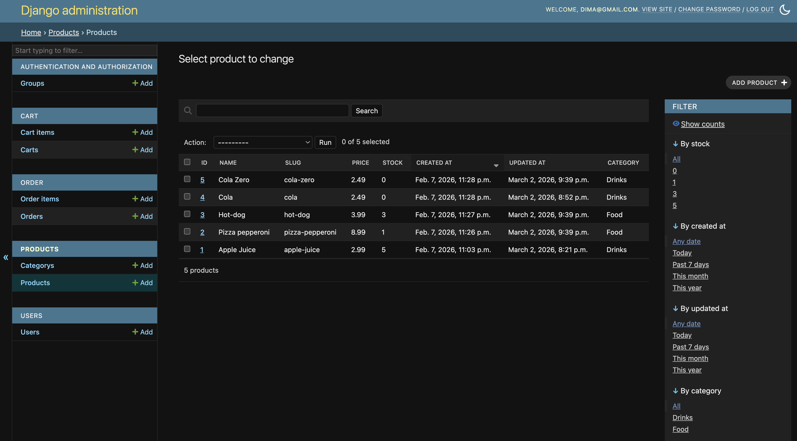


Testing
-------

Run the Django test suite:

	python manage.py test

