# MotionGear 🏋️

Full-stack sports equipment store: a Django REST Framework backend (users, products, carts, orders) with a React storefront.

**Live demo:** [https://motiongear.duckdns.org](https://motiongear.duckdns.org)

## Features

- 🛍️ Product catalog with categories, search and product photos
- 🛒 Per-user shopping cart with quantity management and stock validation
- 📦 Order checkout with a structured delivery address form (auto-formatted Polish postal code, mobile-friendly)
- ✉️ Asynchronous order confirmation emails (Celery + Redis)
- 🔐 JWT authentication (register / login / token refresh)
- 🌍 Language switcher: Polish / English
- 📱 Responsive UI with animations (Tailwind CSS + framer-motion)
- ⚡ Redis caching of product listings
- 🐳 One-command Docker Compose setup with demo data seeding

## Tech stack

| Layer    | Technology |
|----------|------------|
| Backend  | Python 3.13, Django 6, Django REST Framework, SimpleJWT |
| Async    | Celery, Redis (broker + cache) |
| Database | PostgreSQL 15 |
| Frontend | React 19, Vite, TypeScript, Tailwind CSS 4, framer-motion |
| Serving  | gunicorn + nginx (nginx proxies `/api`, `/admin`, `/static` to Django) |
| Tests    | Django test runner, Vitest + React Testing Library |

## Project structure

```
├── config/      # Django settings, urls, celery app
├── users/       # custom user model (email login), registration, JWT
├── products/    # categories & products API, demo data seed command
├── cart/        # shopping cart API
├── order/       # order API + confirmation email task
├── frontend/    # React SPA (Vite), served by nginx in Docker
└── screenshots/ # API screenshots used below
```

## Quick start (Docker)

Requirements: Docker with Compose v2.

1. Create your env file and adjust the values:

   ```bash
   cp .env.example .env
   ```

2. Build and start the stack:

   ```bash
   docker compose up --build -d
   ```

3. Open the app:

   - Storefront (SPA): http://localhost:3000/
   - DRF API browser: http://localhost:8000/api/v1/store/
   - Admin panel: http://localhost:3000/admin/ (or http://localhost:8000/admin/)

On startup the `web` container applies migrations, collects static files and seeds demo categories/products (idempotent `seed_sports_store` command).

Optionally create an admin account:

```bash
docker compose exec web python manage.py createsuperuser
```

### Services

| Service    | Description                          | Port (localhost) |
|------------|--------------------------------------|------------------|
| `frontend` | nginx serving the SPA, proxies API   | 3000 |
| `web`      | Django API (gunicorn in production)  | 8000 |
| `celery`   | background worker (emails)           | — |
| `db`       | PostgreSQL 15 (volume `postgres_data`) | — |
| `redis`    | cache + Celery broker                | — |

## Environment variables

See [.env.example](.env.example) for the full annotated list. The essentials:

- `SECRET_KEY` — Django secret key
- `DB_NAME`, `DB_USER`, `DB_PASSWORD`, `DB_HOST`, `DB_PORT` — Postgres connection (Django)
- `POSTGRES_DB`, `POSTGRES_USER`, `POSTGRES_PASSWORD` — Postgres container init
- `REDIS_HOST` — Redis host (`redis` in Docker)
- `EMAIL_HOST_USER`, `EMAIL_HOST_PASSWORD`, `DEFAULT_FROM_EMAIL` — SMTP for order confirmations

For production additionally set `DEBUG=False`, `ALLOWED_HOSTS`, `CORS_ALLOWED_ORIGINS` and `CSRF_TRUSTED_ORIGINS` (HTTPS redirect, secure cookies and HSTS are then enforced automatically).

## Local development

Backend on the host, DB/Redis in Docker:

```bash
docker compose up -d db redis
python3 -m venv .venv && source .venv/bin/activate
pip install -r requirements.txt
python manage.py migrate
python manage.py runserver
```

Frontend with hot reload (proxies `/api` to `http://127.0.0.1:8000`, see [frontend/vite.config.ts](frontend/vite.config.ts)):

```bash
cd frontend
npm install
npm run dev
```

## Testing

Backend (uses in-memory SQLite and locmem cache — no Postgres/Redis/SMTP needed):

```bash
python manage.py test
```

Frontend (Vitest + React Testing Library):

```bash
cd frontend
npm test
```

## API overview

Routes are mounted under `/api/v1/` in [config/urls.py](config/urls.py).

| Method | Endpoint | Description |
|--------|----------|-------------|
| GET | `/api/v1/store/` | product list (paginated, `?category=` filter) |
| GET | `/api/v1/store/<id>/` | product detail |
| GET | `/api/v1/store/categories/` | category list |
| GET | `/api/v1/store/categories/<id>/` | category detail |
| POST | `/api/v1/auth/register/` | register |
| POST | `/api/v1/token/` | obtain JWT pair |
| POST | `/api/v1/token/refresh/` | refresh access token |
| GET | `/api/v1/carts/` | current user's cart (auth) |
| POST | `/api/v1/carts/add_item/` | add product to cart (auth) |
| GET/PUT/PATCH/DELETE | `/api/v1/carts/items/<id>/` | manage a cart item (auth) |
| GET | `/api/v1/orders/order_list/` | user's orders (auth) |
| GET | `/api/v1/orders/order_detail/<id>/` | order detail (auth) |
| POST | `/api/v1/orders/order_create/` | create order from cart (auth) |

<details>
<summary>API screenshots (DRF browsable API)</summary>

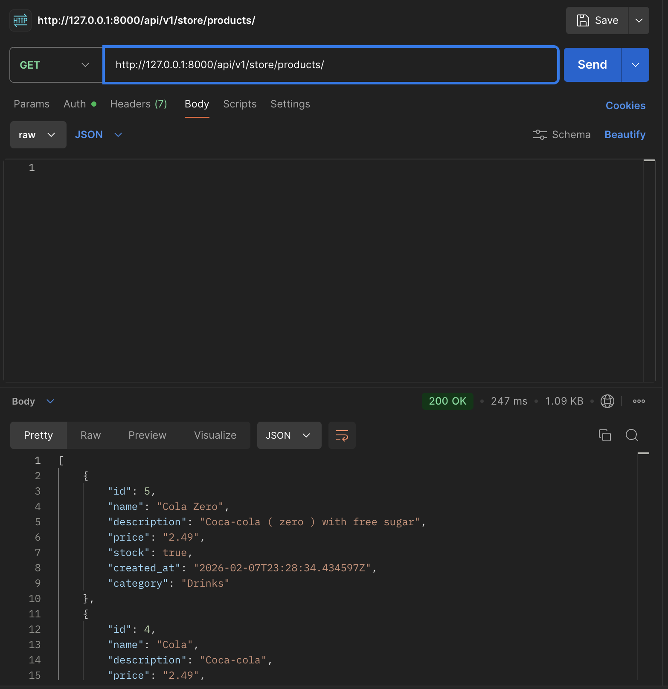
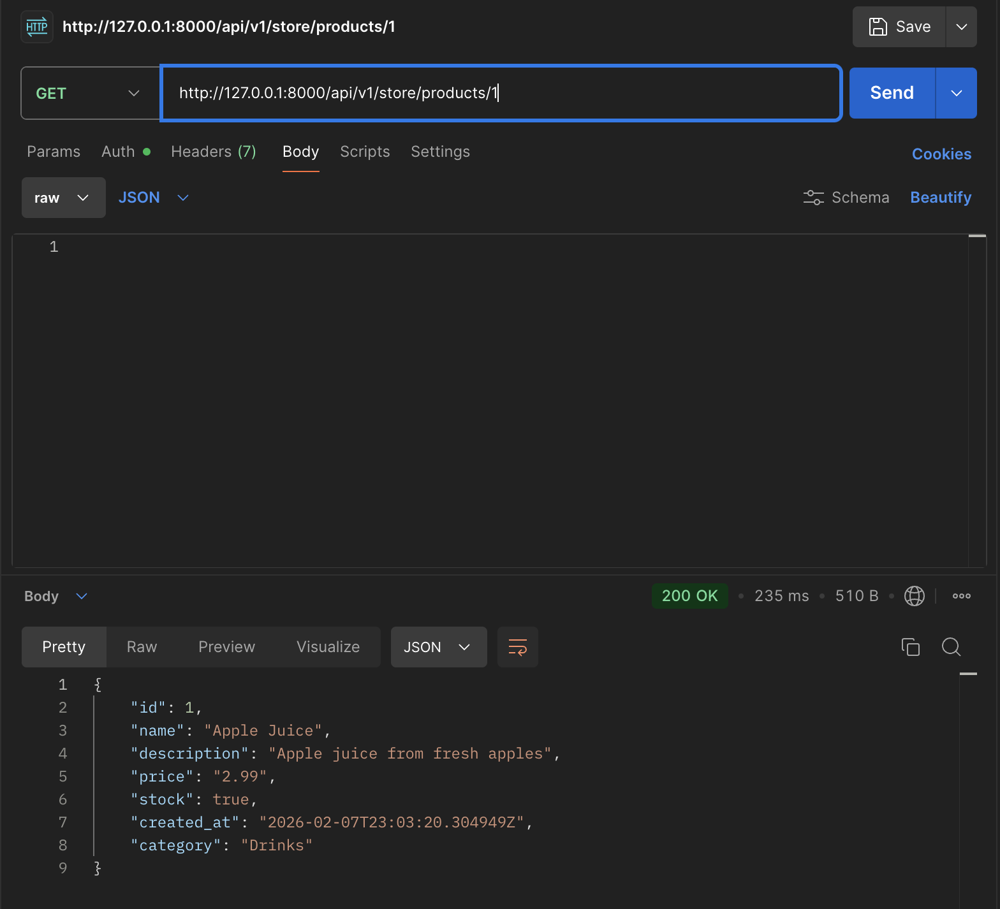
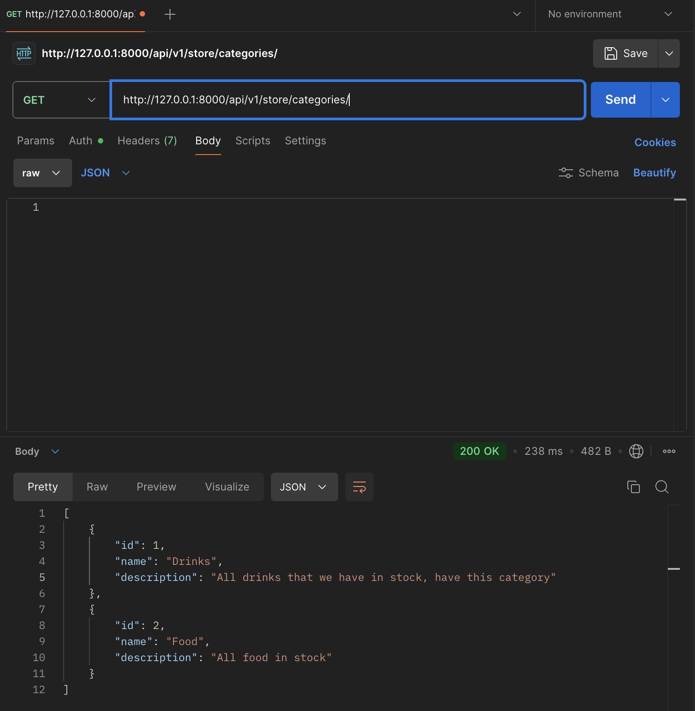
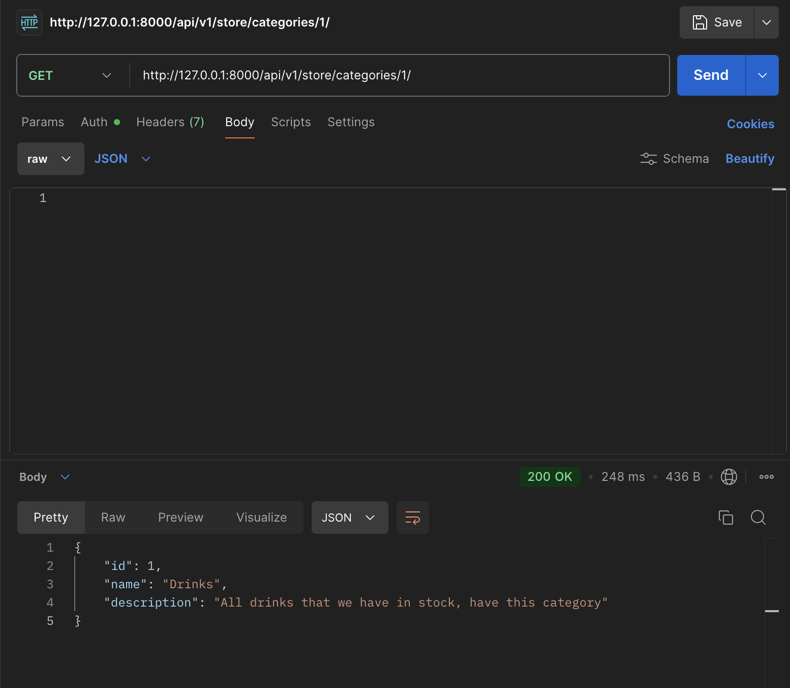
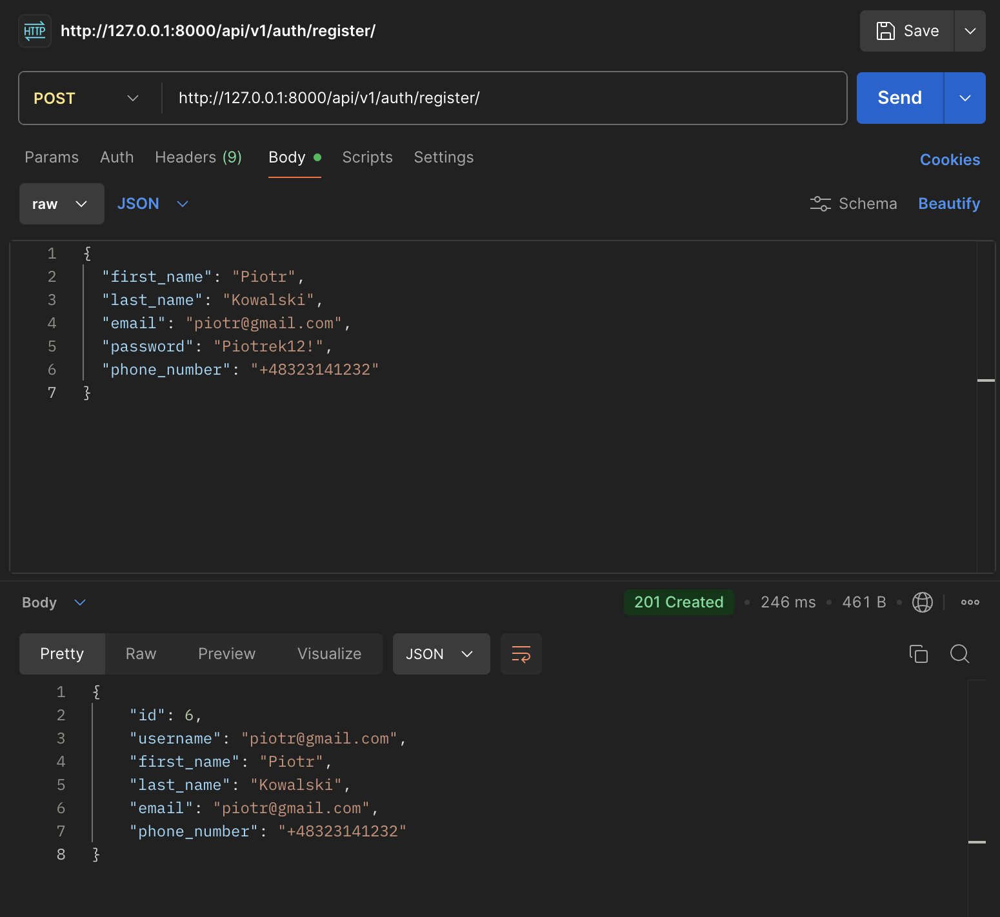
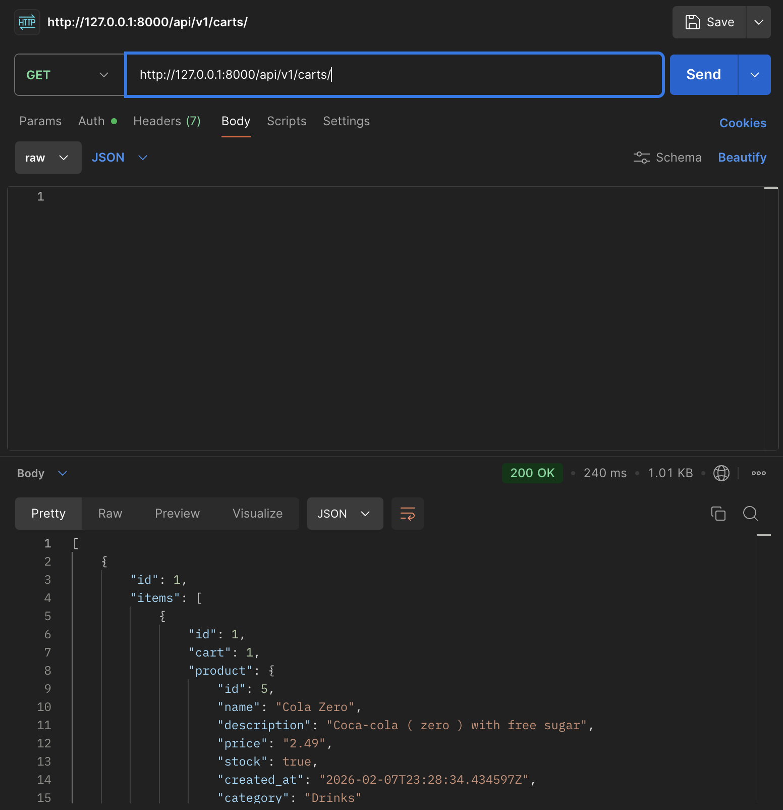
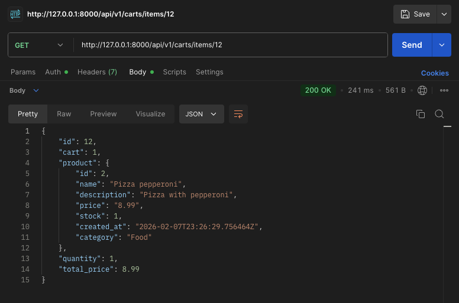
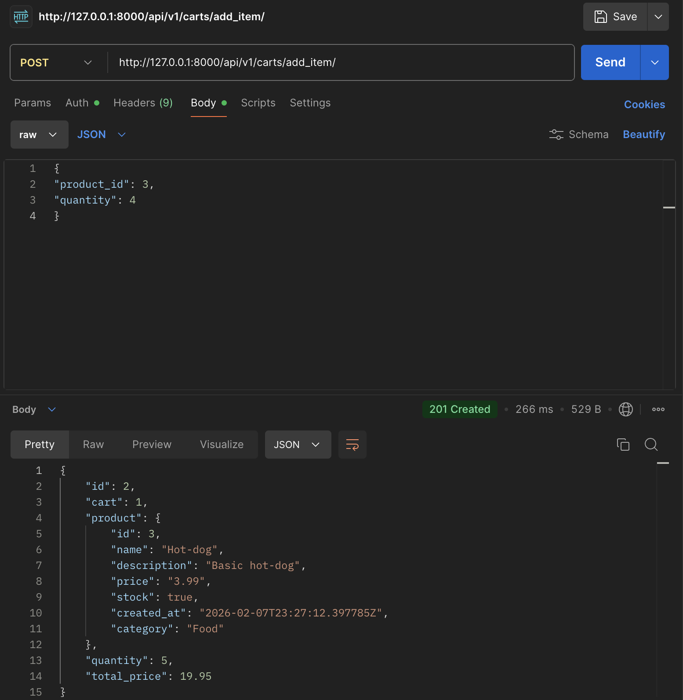
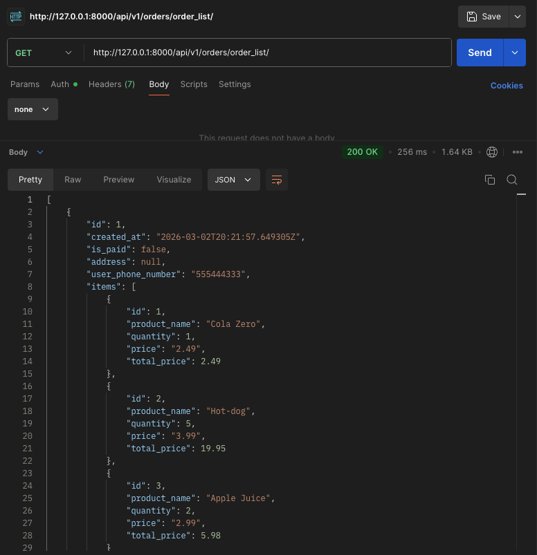
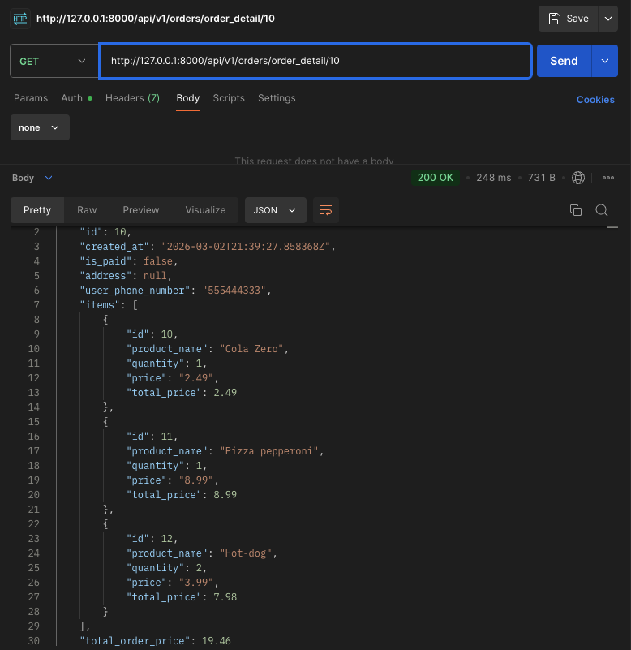
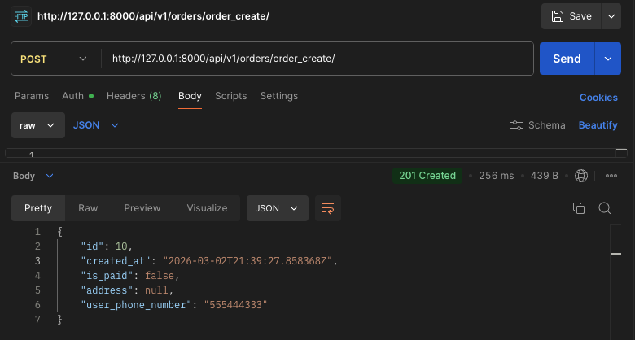
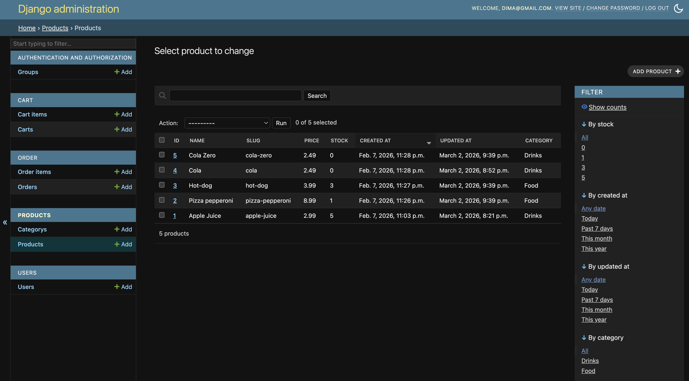

</details>
